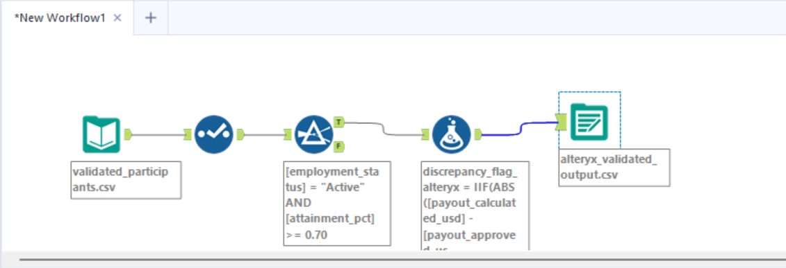
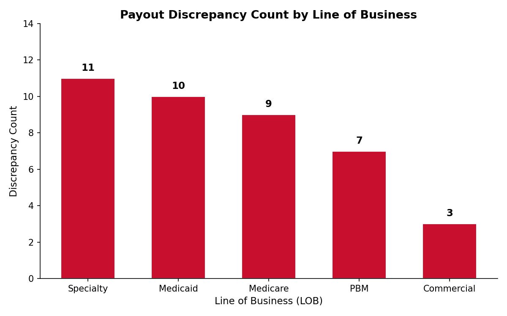

# Sales Incentive Payout Validator

**Domain:** Healthcare PBM (Pharmacy Benefit Manager) — Sales Compensation  
**Stack:** Python · pandas · openpyxl · Matplotlib · Alteryx Designer

---

## Business Context

Before incentive payouts reach payroll, a Sales Comp Analyst must validate every
participant record against eligibility rules and flag discrepancies. This project
simulates that validation pipeline for a 500-participant PBM sales team across
5 Lines of Business (LOBs) and 12 monthly cycles (Jan–Dec 2024).

---

## Pipeline Overview
Raw CSV (500 rows)
│
▼
[generate_data.py] → Synthetic participant data with injected errors
│
▼
[validate.py] → 3 business rules applied → flag columns added
│
▼
[export_excel.py] → 3-sheet Excel report with conditional formatting
│
▼
[audit_and_chart.py] → Audit log + discrepancy bar chart (PNG)
│
▼
[Alteryx Workflow] → Drag-and-drop replication of validation logic

---

## Business Rules Applied

| Rule | Condition | Flag Column |
|------|-----------|-------------|
| Eligibility | employment_status = Active AND attainment_pct ≥ 70% | `eligibility_pass` |
| Payout Discrepancy | \|payout_calculated − payout_approved\| > $50 | `discrepancy_flag` |
| Missing Quota | quota_usd is null or 0 | `missing_quota_flag` |

---

## Key Results

| Metric | Value |
|--------|-------|
| Total participants | 500 |
| Eligibility failures | 197 (39.4%) |
| Payout discrepancies | 40 (8.0%) |
| Missing quota | 35 (7.0%) |
| Total flagged for Review | 228 (45.6%) |
| Clean records | 272 (54.4%) |

---

## Outputs

| File | Description |
|------|-------------|
| `outputs/validated_payouts.xlsx` | 3-sheet audit report with red-flagged rows |
| `outputs/validation_log.txt` | Audit trail — rules applied, error counts |
| `outputs/discrepancy_chart.png` | Discrepancy count by LOB (bar chart) |
| `alteryx/payout_validation.yxmd` | Alteryx Designer workflow |

---

## Alteryx Workflow

Replicates the Python validation logic using drag-and-drop tools:  
`Input Data → Select (type cast) → Filter (eligibility) → Formula (discrepancy flag) → Output Data`



---

## Discrepancy Chart



---

## Folder Structure
sales-incentive-payout-validator/
├── data/
│   ├── raw/                  # Generated CSV
│   └── processed/            # Validated CSV
├── src/
│   ├── generate_data.py
│   ├── validate.py
│   ├── export_excel.py
│   └── audit_and_chart.py
├── alteryx/
│   ├── payout_validation.yxmd
│   └── alteryx_validated_output.csv
├── outputs/
│   ├── validated_payouts.xlsx
│   ├── validation_log.txt
│   ├── discrepancy_chart.png
│   └── alteryx_workflow_screenshot.png
├── requirements.txt
└── README.md

---

## Setup

```bash
pip install -r requirements.txt
python src/generate_data.py
python src/validate.py
python src/export_excel.py
python src/audit_and_chart.py
```